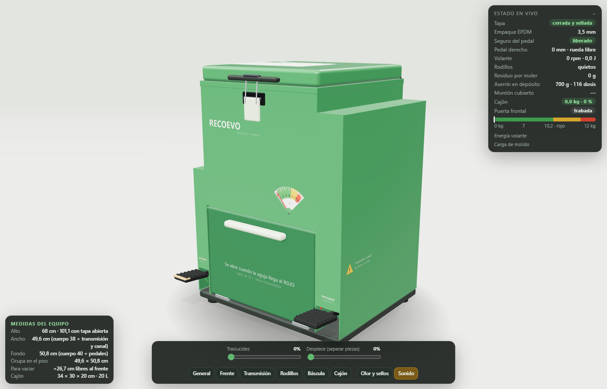

# Recoevo · Triturador analógico a pedal — Prototipo 3D interactivo

**Ábrelo aquí:** https://whafonsecav.github.io/Proceso-admin-prototipo/



Este repositorio contiene **solo el prototipo 3D** del triturador de residuos orgánicos del proyecto **Recoevo**: el archivo que se ve en el navegador, el código con el que se hizo (separado por partes y comentado), las texturas, las pruebas automáticas, las capturas y la documentación de cómo funciona y cómo se construyó.

---

## 1. ¿Qué es esto?

**Recoevo** es un proyecto académico de economía circular pensado para la localidad de Usme (Bogotá). La idea es que cada hogar triture en su cocina los residuos orgánicos (cáscaras, sobras, café, cáscara de huevo, servilletas), los guarde en una bolsa compostable y una ruta los recoja para convertirlos en compost.

El estudio del proyecto describe un aparato eléctrico. Este prototipo es la versión **analógica y de bajo costo**: **no tiene motor, ni electricidad, ni sensores**. Todo se mueve con los pies y con piezas mecánicas sencillas. Se respetan las medidas del modelo hogar del estudio: cuerpo de **38 × 40 × 68 cm** y cajón de **20 litros**.

"Prototipo 3D" quiere decir aquí un **modelo virtual que funciona**: no es un dibujo quieto. Cada pieza tiene peso, los resortes empujan, el volante guarda energía, las piezas chocan entre sí y los residuos se parten según la energía que reciben. Sirve para entender, explicar y revisar el diseño antes de fabricar uno de verdad.

## 2. Cómo abrirlo

- **En línea:** entra al enlace de arriba. Funciona en computador y en celular (Chrome, Edge, Firefox o Safari recientes).
- **En tu computador:** descarga el repositorio y abre `index.html` con doble clic. Necesita internet la primera vez, porque la librería 3D (Three.js) se descarga de un servidor público (jsDelivr).

## 3. Cómo se usa

Arriba a la izquierda hay dos modos. La página abre en **Manual**:

| Modo | Para qué sirve |
|---|---|
| **Manual** | Cómo se usa (ciclo de uso), cómo funciona cada sistema, cómo se arma (orden de montaje) y la lista completa de piezas. Cada sistema tiene un botón **Mostrarme** que ubica la cámara y señala sus piezas con rótulos numerados. |
| **Libre** | Todos los botones a la vista, para usar la máquina en el orden que quieras. |

**Con el mouse (o el dedo):**

- **Arrastrar el fondo:** girar la vista. **Rueda / pellizco:** acercar. **Clic derecho:** desplazar. Puedes mirar incluso **por debajo** del equipo.
- **Arrastrar piezas** como si fuera una mano: la tapa, la puerta frontal, el cajón, la bolsa llena (y luego dejarla en el piso).
- **Doble clic:** abrir o cerrar la tapa, la puerta o el cajón.
- **Mantener presionado** un pedal: pisarlo.
- **Pasar el cursor** sobre cualquier pieza: aparece su ficha (qué es, de qué material, qué medida, para qué sirve).

**Teclado:** `Espacio` pedal derecho · `C` pedal izquierdo · `T` tapa · `G` gancho · `R` echar residuos · `F` puerta · `D` cajón · `P` pedaleo rítmico · `Esc` salir del foco en el despiece.

**Barra de abajo (siempre visible):**

- **Traslucidez:** vuelve transparente la carcasa para ver el mecanismo por dentro.
- **Despiece:** separa **todas** las piezas con una animación. Haz clic en cualquiera para verla sola (las demás quedan casi invisibles), girar a su alrededor y leer su ficha; recórrelas con *Anterior / Siguiente*. `Esc` o *Ver todas las piezas* para volver.
- **Vistas rápidas** (General, Frente, Transmisión, Rodillos, Báscula, Cajón), **Olor y sellos** (muestra el recorrido del aire) y **Sonido**.

Abajo a la izquierda hay un cuadro fijo con **las medidas del equipo** y el espacio que ocupa.

## 4. Qué hay en este repositorio

```
index.html                  ← EL PROTOTIPO. Es el archivo que publica GitHub Pages.
README.md                   ← Este documento.
fuente/                     ← El código con el que se armó index.html, en partes:
  00_pagina_e_interfaz.html        estructura de la página, estilos y paneles
  01_escena_materiales_y_utilidades.js   cámara, luces, materiales y funciones de geometría
  02_cuerpo_camara_rodillos_tapa_puerta_cajon.js   la carcasa, la cámara de inox, los rodillos,
                                                    la tapa, el gancho, la puerta, el cajón y la bolsa
  03_transmision_seguros_bascula_aserrin_olores.js engranajes, cadena, volante, pedales, seguro
                                                    infantil, báscula, dosificador de aserrín y olores
  04_fisica_de_mecanismos.js       las ecuaciones: pedales, volante, tapa, puerta, cajón y báscula
  05_residuos_particulas_y_monton.js   los trozos de comida, la trituración y el montón en la bolsa
  06_sincronia_visual_bolsa_y_sacos.js  mueve cada pieza según la física; la bolsa que se saca
  06b_despiece_rotulos_olor_sonido.js   despiece, resaltado, rótulos 3D, aire con olor y sonidos
  07_fichas_de_piezas_y_guia.js    la ficha de cada pieza (qué es, material, medida, función)
  07b_interfaz_manual_y_mano_virtual.js  botones, manual, arrastre con el mouse, panel de estado
  08_bucle_principal.js            el ciclo que avanza la simulación y dibuja cada cuadro
  construir.py                     une todas las partes en index.html
texturas/                   ← Las texturas del modelo exportadas como imágenes PNG
                              (se generan con código; aquí están para verlas y reutilizarlas)
capturas/                   ← Imágenes del prototipo usadas en esta documentación
pruebas/                    ← Pruebas automáticas y herramientas:
  prueba_ciclo_completo.js         recorre solo un ciclo completo de uso y verifica cada paso (15)
  prueba_energia_de_molienda.js    registra la energía del volante mientras muele
  tomar_captura.py                 abre el prototipo en un navegador invisible y toma capturas
  exportar_texturas.py             guarda las texturas del modelo como PNG
docs/                       ← Documentación detallada:
  COMO_FUNCIONA.md                 cada sistema de la máquina, pieza por pieza, con sus medidas
  FISICA_Y_PARAMETROS.md           las leyes físicas usadas y todos los valores numéricos
  COMO_SE_HIZO.md                  herramientas, proceso, decisiones de diseño y correcciones
  MATERIALES_Y_PIEZAS.md           colores, materiales, texturas y la lista de las 97 piezas
```

## 5. La máquina en un minuto

1. **Echas los residuos** por la boca de 22 × 22 cm y **cierras la tapa con el gancho**: el empaque de caucho queda apretado y no sale olor.
2. **Pisas el pedal derecho** varias veces. Por dentro: pedal → cremallera → rueda libre (como la de una bicicleta) → cadena → **volante de inercia** → reductor → **dos rodillos con cuchillas** que giran hacia el centro y parten la comida. La pulpa cae directo a la bolsa del cajón.
3. **Pisas el pedal izquierdo** una vez: una placa con agujeros deja caer **una dosis de aserrín** por atrás y por los lados, que tapa lo recién molido y evita el mal olor.
4. El cajón está sobre **cuatro resortes**. Con el peso bajan, y una palanca mueve una **flecha** sobre una lámina de colores. Cuando llega al **rojo** (10,2 kg), esa misma palanca **destraba la puerta frontal**.
5. Abres la puerta, sacas el cajón, **levantas la bolsa** (su cordón la cierra sola), pones una bolsa nueva y cierras.

**Seguridad sin electrónica:** mientras la tapa no esté cerrada y apretada, un **pasador rojo de acero** queda debajo del pedal y no lo deja bajar. Así nadie puede moler con la boca abierta. Con la puerta frontal abierta, otros pasadores bloquean los dos pedales. Todo se explica en [docs/COMO_FUNCIONA.md](docs/COMO_FUNCIONA.md).

## 6. Cómo modificarlo

1. Cambia lo que necesites en los archivos de la carpeta `fuente/`. Cada archivo empieza con un título que dice qué contiene, y el código tiene comentarios en español.
2. Ejecuta `python fuente/construir.py`: vuelve a crear `index.html` y, si tienes Node.js, revisa que no haya errores.
3. Para probar en tu computador: en la carpeta del repositorio ejecuta `python -m http.server 8765` y abre `http://127.0.0.1:8765/`.
4. Opcional, pruebas automáticas (requieren `pip install playwright` y Microsoft Edge):
   `python pruebas/tomar_captura.py ciclo "$(cat pruebas/prueba_ciclo_completo.js)" 0.3`
   Debe responder "ok" en las 15 comprobaciones.

Las medidas principales están juntas al comienzo de `01_escena_materiales_y_utilidades.js` (objetos `D` y `T`), y las constantes físicas al comienzo de `04_fisica_de_mecanismos.js` (objeto `K`).

## 7. Herramientas (todas gratuitas)

| Herramienta | Para qué se usó | Licencia |
|---|---|---|
| [Three.js](https://threejs.org) 0.169 | Dibujar el 3D en el navegador (WebGL), con materiales físicos (PBR), sombras y reflejos de estudio | MIT |
| JavaScript puro | Toda la física, la interfaz y la guía, escritas desde cero para este prototipo | — |
| [Playwright](https://playwright.dev) + Microsoft Edge | Pruebas automáticas y capturas | Apache 2.0 |
| Python y Node.js | Unir las partes del código y revisar la sintaxis | Libres |
| GitHub Pages | Publicar la página | Gratuito |

No se usó ningún modelo 3D descargado ni ninguna imagen externa: **todas las piezas se construyen con código a partir de sus medidas**, y todas las texturas se dibujan con código.

## 8. Lo que este prototipo NO es (límites honestos)

- Es una **simulación de ingeniería para entender y comunicar el diseño**, no un plano de fabricación. Antes de fabricar hay que hacer planos, cálculos de resistencia y un prototipo físico.
- Los valores físicos (fuerza del pie, dureza de cada residuo, rozamientos) son **estimaciones razonables**, explicadas en [docs/FISICA_Y_PARAMETROS.md](docs/FISICA_Y_PARAMETROS.md). Los tiempos y las fuerzas reales pueden variar.
- El ancho total (49,6 cm) es mayor que el del modelo hogar eléctrico (38 cm) porque el carter de la transmisión y el canal del pedal izquierdo van por fuera del cuerpo.

## 9. Contexto académico

Proyecto de la asignatura *Proceso Administrativo*. El estudio de mercado, los costos y el modelo de negocio de Recoevo están en los documentos del curso; este repositorio contiene solamente el prototipo 3D.
